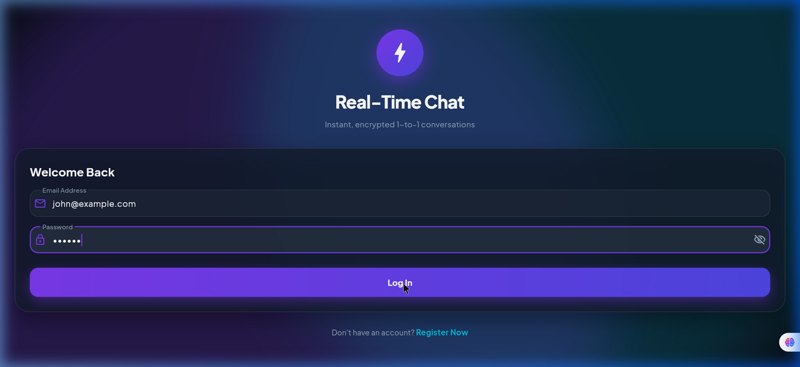

# 🐼 BAO CHAT — Real-Time Community 🌿

<div align="center">

  

  ### *Playful Vibes, Real-Time Community & Ultra-Smooth 3D Experience*

  [](https://flutter.dev/)
  [](https://firebase.google.com/)
  [](https://pub.dev/packages/provider)
  [](https://flutter.dev/)
  [](LICENSE)

</div>

---

## 🌟 Overview

**BAO CHAT** is an open-source, production-ready real-time social messaging platform built with **Flutter**, **Firebase Authentication**, and **Cloud Firestore**. 

It features an official **PanPan 🐾 Panda Mascot** identity, **Bamboo Emerald** (`#34A853`) design system, unique `@username` handle identification, interactive Profile Avatar setup, 3D glassmorphic card physics, and real-time message streaming with reactions, replies, and pinning.

---

## ✨ Key Features

### 🐼 1. Brand Concept & Official 3D Logo
- **Official Mascot**: PanPan 🐾 the Community Panda.
- **Color Palette**: Bamboo Emerald (`#34A853`), Midnight Obsidian (`#141720`), Vibe Sky Blue (`#4285F4`), and Sunny Amber (`#FFBB00`).
- **Official Asset**: Circular 3D Panda Bao logo embedded in auth screens, app bar, and community cards.

### 📸 2. Profile Picture Setup & Panda Avatars
- **Custom Profile Photos**: Setup and change profile pictures at registration or anytime via **Edit Profile**.
- **Panda Avatar Presets**: Select from curated avatars (PanPan Classic 🐾, Tech Wiz 💻, Bao Chef 🥟, Social Butterfly 💬, Explorer 🌍).
- **Universal Avatar Component**: `PandaAvatarWidget` with glowing emerald rim lighting and live online status indicators.

### 🏷️ 3. Unique `@username` Handle System
- **Handle Identification**: Every user has a unique handle (e.g. `@jarifovi`, `@panpan_wave`).
- **Global Search**: Search users instantly across display names, `@username` handles, or email addresses.

### 🔮 4. Ultra-Smooth 3D Glassmorphic Interface
- **3D Tilt Rotation**: `Gravity3DCard` with dynamic `Matrix4` tilt rotation and glowing rim borders on hover.
- **3D Floating Orbs**: `Gravity3DOrb` animated background spheres with smooth sine-wave physics.
- **Fluid Bouncing Physics**: Custom `UltraSmoothGravityScrollPhysics` spring physics engine.

### 💬 5. Real-Time 1-to-1 Chat Engine
- **Deterministic Room ID**: Automatically generates unique chat rooms: `[uid1, uid2]..sort().join('_')`.
- **Live Firestore Streams**: Instant message delivery with real-time snapshots.
- **Rich Chat Features**: Message Reactions (❤️, 👍, 🔥, 😂), Message Replies, Message Pinning, and Message Editing.

---

## 🛠️ Technology Stack

| Component | Technology |
|---|---|
| **Framework** | [Flutter](https://flutter.dev/) (Dart 3.x) |
| **Backend & Database** | [Firebase Authentication](https://firebase.google.com/docs/auth) & [Cloud Firestore](https://firebase.google.com/docs/firestore) |
| **State Management** | [Provider](https://pub.dev/packages/provider) |
| **Design Tokens** | Custom Glassmorphism, Google Fonts (`Plus Jakarta Sans`) |
| **Security** | SHA-256 Hashing (`crypto` package) |
| **Formatting** | `intl` Date & Timestamp Formatter |

---

## 📁 Project Structure

```
c:\Users\DFIT\Downloads\Real-Time Chat App\
├── assets/
│   └── images/
│       └── bao_chat_logo.png      # Official 3D BAO CHAT Panda Logo Asset
├── lib/
│   ├── main.dart                  # Entry point & MultiProvider setup
│   ├── firebase_options.dart      # Firebase configuration options
│   ├── models/
│   │   ├── user_model.dart        # User model with @username & photoUrl
│   │   ├── chat_room_model.dart   # Chat room model & deterministic ID generator
│   │   └── message_model.dart     # Message model with reactions & reply data
│   ├── providers/
│   │   ├── auth_provider.dart     # User authentication & profile edit state
│   │   ├── user_provider.dart     # Global community user discovery search
│   │   ├── chat_provider.dart     # Real-time chat room management
│   │   └── message_provider.dart  # Message streaming, reactions & pinning
│   ├── screens/
│   │   ├── login_screen.dart      # 3D Glassmorphic login screen with logo asset
│   │   ├── register_screen.dart   # Registration screen with avatar selector
│   │   ├── main_navigation_screen.dart # Floating glass bottom navigation bar
│   │   ├── chat_room_screen.dart  # Real-time chat room interface
│   │   └── tabs/
│   │       ├── users_tab.dart     # Community discovery tab
│   │       ├── chats_tab.dart     # Active conversations tab
│   │       └── profile_tab.dart   # Account settings & edit profile dialog
│   ├── services/
│   │   ├── auth_service.dart      # Firebase Auth & local fallback engine
│   │   └── firestore_service.dart # Firestore CRUD & real-time snapshot streams
│   ├── theme/
│   │   └── app_theme.dart         # Bamboo Emerald color palette & spring physics
│   ├── widgets/
│   │   ├── gravity_3d_card.dart   # Interactive 3D matrix card container
│   │   ├── gravity_3d_orb.dart    # Floating animated orb background
│   │   └── panda_avatar_widget.dart # Universal panda avatar component
│   └── utils/
│       └── date_formatter.dart    # Human-readable date & time utilities
└── pubspec.yaml
```

---

## 🗄️ Firestore Database Schema

```
/users
   ├── {userId}
   │     ├── name: string
   │     ├── username: string (e.g., "jarifovi")
   │     ├── email: string
   │     ├── photoUrl: string (optional avatar URL)
   │     └── createdAt: timestamp

/chats
   ├── {chatRoomId} (e.g. "uid1_uid2")
   │     ├── participants: array ["uid1", "uid2"]
   │     ├── lastMessage: string
   │     ├── lastMessageAt: timestamp
   │     ├── isTyping: map { "uid1": false, "uid2": true }
   │     ├── pinnedMessage: string (optional)
   │     └── createdAt: timestamp
   │
   └── /messages (Subcollection)
          └── {messageId}
                ├── senderId: string
                ├── receiverId: string
                ├── message: string
                ├── reactions: map { "uid1": "❤️" }
                ├── replyTo: map { "messageId": "...", "message": "..." }
                └── timestamp: timestamp
```

---

## 🚀 Quick Start Guide

### Prerequisites
- [Flutter SDK](https://docs.flutter.dev/get-started/install) (v3.0.0 or higher)
- [Dart SDK](https://dart.dev/get-started/sdk)

### 1. Clone the Repository
```bash
git clone https://github.com/jarifovi/Real-Time-Chat-App.git
cd Real-Time-Chat-App
```

### 2. Install Dependencies
```bash
flutter pub get
```

### 3. Run the App Locally
```bash
# Run on Web (Chrome)
flutter run -d chrome

# Run on Desktop (Windows)
flutter run -d windows
```

---

## 🤝 Contributing & Auto-Contributor

We welcome all community contributions! If you fork or download this repository on GitHub:
1. Make your improvements or additions.
2. Submit a Pull Request (PR) to the `main` branch.
3. Your contribution will automatically list you on the **Contributors** section!

---

## 👤 Author & Maintainer

Designed and developed with ❤️ by **Jarif Ovi**:
- GitHub: [@jarifovi](https://github.com/jarifovi)
- Project Repository: [https://github.com/jarifovi/Real-Time-Chat-App](https://github.com/jarifovi/Real-Time-Chat-App)

---

## 📄 License

This project is licensed under the [MIT License](LICENSE).
